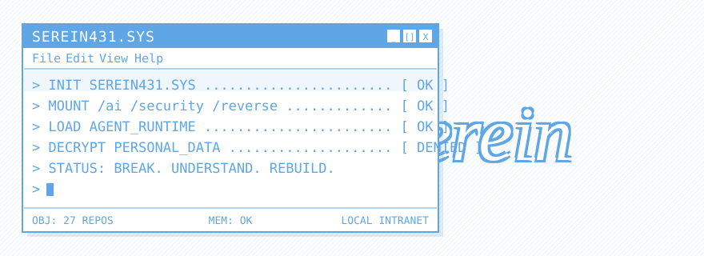

<div align="center">

<picture>
  <source media="(prefers-color-scheme: dark)" srcset="./assets/hero-dark.svg">
  
</picture>

<br /><br />

[](https://github.com/serein431)

</div>

<br />

```console
serein431@localhost:~$ whoami

  ID .............. serein431
  DOMAIN .......... AI × cyberspace security
  MODE ............ research → prototype → product
  BIO ............. [ REDACTED ]
  LOCATION ........ 127.0.0.1
  STATUS .......... online // building
```

<div align="center">

`the machine speaks in two colors and never in emoji`

</div>

<br />

## `~/system` &nbsp;// &nbsp;operating principles

```text
[KERNEL]
  break        understand a system by taking it apart
  understand   read the assembly, not just the docs
  rebuild      turn what you learn into tools other people can use

[POLICY]
  personal_data  = encrypted
  noise          = muted
  signal         = shipped
```

<br />

## `~/stack` &nbsp;// &nbsp;loaded modules

<div align="center">


</div>

<div align="center">

`reverse engineering` &nbsp;·&nbsp; `binary analysis` &nbsp;·&nbsp; `LLM security` &nbsp;·&nbsp; `autonomous agents` &nbsp;·&nbsp; `security automation`

</div>

<br />

## `~/upstream` &nbsp;// &nbsp;merged contributions

```text
[Codex-Manager]
  result    fixed session failures after a Codex update
  result    fixed local gateway account detection
  status    merged upstream // PR #346
  proof     https://github.com/qxcnm/Codex-Manager/pull/346
```

[](https://github.com/qxcnm/Codex-Manager/pull/346)

<br />

## `~/telemetry`

<div align="center">

<picture>
  <source media="(prefers-color-scheme: dark)" srcset="https://raw.githubusercontent.com/serein431/serein431/output/github-contribution-grid-snake-dark.svg">
  
</picture>

</div>

<br />

## `~/signal`

<div align="center">

[](https://github.com/serein431/Codex-Mate)
[](https://github.com/serein431/DoneGraph)
[](https://github.com/serein431/Remote-Codex-API)

</div>

<br />

<div align="center">


</div>
